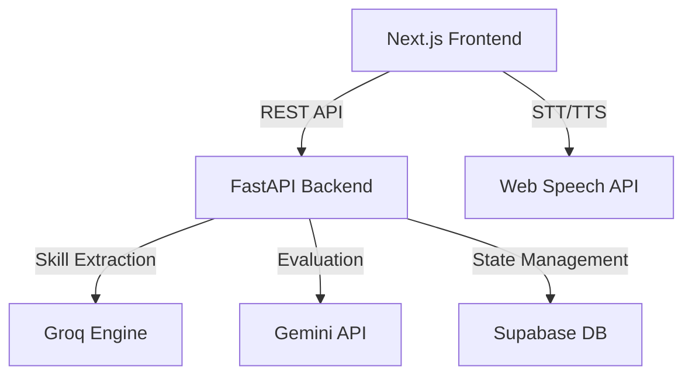

# 🎤 AI Interviewer: Professional Technical Portal


> **The next generation of technical assessment.** A fully hands-free, voice-first AI interviewer that extracts skills from Job Descriptions and assesses candidates with a strict, professional persona.

---

## ✨ Key Features

### 🎙️ Hands-Free Voice Interview
Powered by the **Web Speech API**, the platform features an automated "Auto-Listen/Auto-Speak" flow. The AI asks a question, waits for the candidate to speak, and transitions seamlessly to the next challenge.

### ⏳ Smart Inactivity Timer
Never let an interview stall. If no response is detected within **60 seconds**, the AI intelligently checks in or moves to the next technical topic.

### 📊 Real-Time Skill Coverage
Visible feedback for the candidate. The sidebar features a dynamic **Progress Bar** that updates instantly as topics are covered, calculated by our LLM backend.

### 🤖 Expert LLM Orchestration
- **Groq (Llama 3.3 70B)**: Fast, low-latency orchestration for chat loops and skill extraction.
- **Google Gemini 1.5 Flash**: High-accuracy technical evaluation and final report generation.

---

## 🛠️ Architecture



---

## 🚀 Quick Start

### 1. Prerequisites
- Python 3.10+
- Node.js 18+
- [Groq API Key](https://console.groq.com)
- [Google AI Key](https://aistudio.google.com)
- [Supabase Project](https://supabase.com)

### 2. Backend Setup
```bash
# Clone the repository
git clone https://github.com/sajar-mohammed/ai-interview-portal.git
cd ai-interview-portal

# Install dependencies
pip install -r requirements.txt

# Configure environment
cp .env.example .env
# Edit .env with your keys

# Start server
python3 -m uvicorn main:app --reload
```

### 3. Frontend Setup
```bash
cd frontend
npm install
npm run dev
```

---

## 🔐 Environment Variables

| Variable | Description |
|---|---|
| `GROQ_API_KEY` | For Llama 3.3 Orchestration |
| `GOOGLE_API_KEY` | For Gemini 1.5 Evaluation |
| `SUPABASE_URL` | Your Supabase Project URL |
| `SUPABASE_ANON_KEY` | Your Supabase Public Key |

---

## 📄 License
MIT License - Developed by **Sajar Mohammed**.
